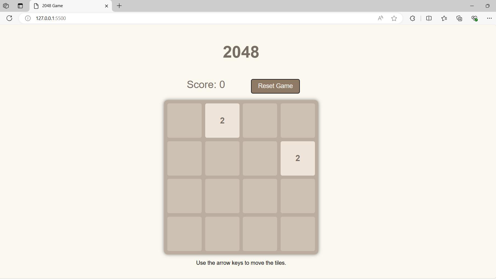

# 2048 Game
A web-based implementation of the classic 2048 game, built using HTML, CSS, and JavaScript as part of a JS Developer roadmap on the ProPeer. Slide and combine tiles to reach the 2048 tile!

## Table of Contents

- [Screenshots](#screenshots)
- [Installation](#installation)
- [Usage](#usage)
- [Features](#features)
- [Technologies Used](#technologies-used)
- [Contributing](#contributing)
- [Credits](#credits)
- [License](#license)

## Screenshots


<!--
## Installation

To set up this project locally, follow these steps:
1. Clone the repository:   
  ```
  git clone https://github.com/anandyelloju/2048-webgame.git
  ```
2. Navigate to the project directory:
  ```
  cd 2048-webgame
  ```
3. Open the '**index.html**' file in your web browser to view the portfolio.

## Usage

- Use the arrow keys on your keyboard to move the tiles.
- Combine tiles with the same number to create larger numbered tiles.
- Try to reach the 2048 tile to win the game.

## Features

- Play the classic 2048 game in your browser.
- Score tracking and Reset button to restart the game.
- Responsive design for various screen sizes, Smooth animations, and transitions

## Technologies Used

- **HTML:** Markup language for creating web pages.
- **CSS:** Stylesheet language for designing web pages.
- **Javascript:** Scripting language for make web pages interactive.

[](https://skillicons.dev)

## Contributing

Contributions are always welcome! - If you have suggestions or improvements.

## Credits

- Inspired by the original 2048 game by Gabriele Cirulli.
- Developed as part of a Propeer course with guidance from ChatGPT.

## License

This project is licensed under the [MIT License](https://choosealicense.com/licenses/mit/) - see the [LICENSE](https://github.com/anandyelloju/2048-webgame/blob/main/LICENSE) file for details.
-->
